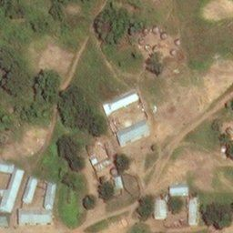
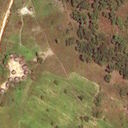
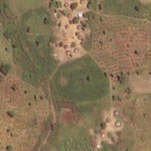
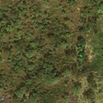
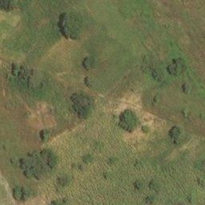
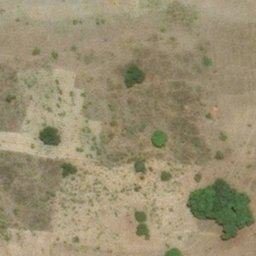
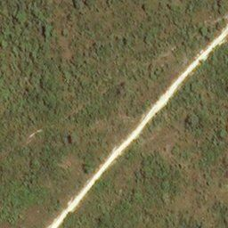

# mapswipe_convnet

Experiments using a Convolutional Neural Network with data from the MapSwipe project

** NOTE ** this is a work in progress - Nov 2017

## Background

## Description of the Problem

Positive Images

The first two images contain rectangular buildings, the last two contain groups of circular huts

Negative Images

These images represent different types of terrain with no buildings

