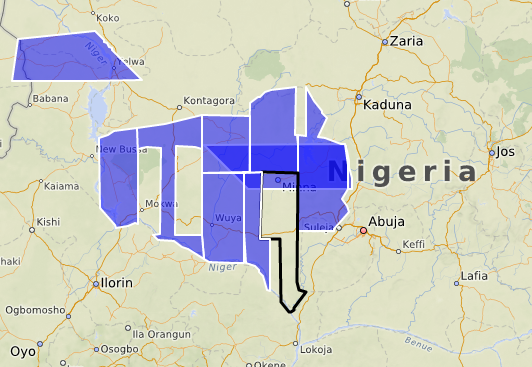
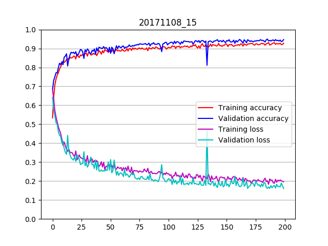

# Experiment 1

This experiment used the code was based on example 5.2 "Using convnets with small datasets"
 in the book  [Deep Learning with Python](https://www.manning.com/books/deep-learning-with-python) by Francois Chollet.

This uses a model with 4 conv2d / maxpooling2 layers that start with 128x128 images

```
_________________________________________________________________
Layer (type)                 Output Shape              Param #
=================================================================
conv2d_1 (Conv2D)            (None, 126, 126, 32)      896
_________________________________________________________________
max_pooling2d_1 (MaxPooling2 (None, 63, 63, 32)        0
_________________________________________________________________
conv2d_2 (Conv2D)            (None, 61, 61, 64)        18496
_________________________________________________________________
max_pooling2d_2 (MaxPooling2 (None, 30, 30, 64)        0
_________________________________________________________________
conv2d_3 (Conv2D)            (None, 28, 28, 128)       73856
_________________________________________________________________
max_pooling2d_3 (MaxPooling2 (None, 14, 14, 128)       0
_________________________________________________________________
conv2d_4 (Conv2D)            (None, 12, 12, 128)       147584
_________________________________________________________________
max_pooling2d_4 (MaxPooling2 (None, 6, 6, 128)         0
_________________________________________________________________
flatten_1 (Flatten)          (None, 4608)              0
_________________________________________________________________
dropout_1 (Dropout)          (None, 4608)              0
_________________________________________________________________
dense_1 (Dense)              (None, 512)               2359808
_________________________________________________________________
dense_2 (Dense)              (None, 1)                 513
=================================================================
Total params: 2,601,153
Trainable params: 2,601,153
Non-trainable params: 0
_________________________________________________________________
```

The dataset used in the initial runs was derived from [MapSwipe Project 4877](http://mapswipe.geog.uni-heidelberg.de/?id=4877)
which aimed to identify buildings in Niger State in Nigeria in support of MSF emergency response in that region.



The Positive dataset consists of those image tiles that MapSwipe volunteers have tagged as containing buildings and
the number of such tags was 5 or more. This ensures that we have a high confidence in those assignments but does
'stack the deck' to some degree. Further experiments will deal with all the data.

The Negative dataset consists of the same number of tiles selected from those that are nearby the positives.
This trick aims to keep the distribution of terrains similar between the two datasets.

This resulted in 4083 tiles in each dataset. These were partitioned into training, validation and test datasets with the ratios
0.6, 0.2, 0.2.

In image classification projects it is common to use Data Augmentation. This is a way to increase the effective
size of a training set by generating copies of each input image and applying a variety of
transformations to those. For example the image can be flipped about an axis, zoomed or rotated.
A number of these are used here, with the exception of image shear as that would distort a rectangular building
into something not seen in the real world.

A number of other changes were applied to the code in order to see some improvement. These include
the number of epochs, the optimizer, the learning rate, batch size and image size. These are
detailed in the code itself.

The code also includes several utility functions that capture the progress in training and validation.

The output goes into a run directory named with the current date and a serial e.g. 20171108_1
In that directory there will be :
* README      - basic run info
* model_summary.txt  - a text summary of the model structure
* history.csv        - CSV file of loss and accuracy by epoch
* plot_[run_id].png  - PNG image of a plot showing loss and accuracy
* mapswipe_model_checkpoint.h5  - HDF file containing the best model
* mapswipe_model_final.h5       - HDF file containing the final model - not necessarily the same

The script is run like this:
```
$ ./mapswipe_convnet.py --project ../project_data --n_epochs 50 --output ~/output --message "changed droput to 0.6"
```

If the user supplies a message this will be written to the README file


## Results

The loss and accuracy plot shows rapid change early in training followed by slow, steady progress over 200 epochs to
an accuracy of around 95%.



A common problem with Convnets is Overfitting, typically caused by too little training data. This plot shows no sign of this.


## Next Steps


