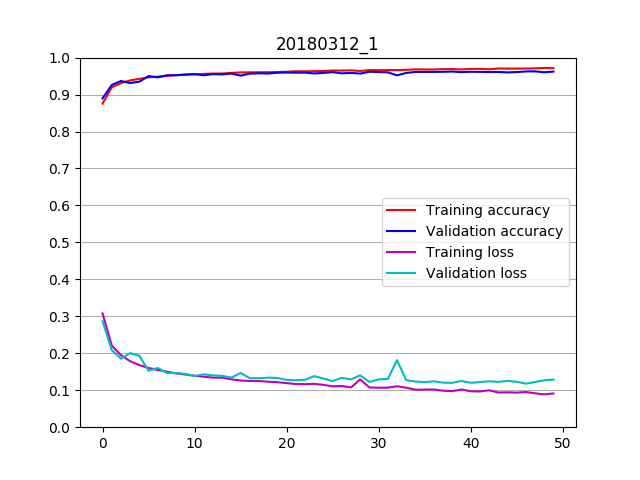
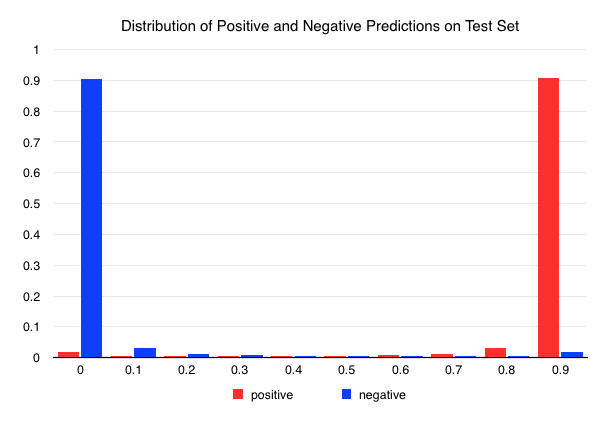
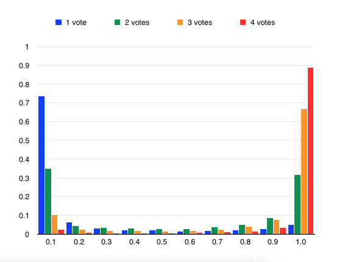
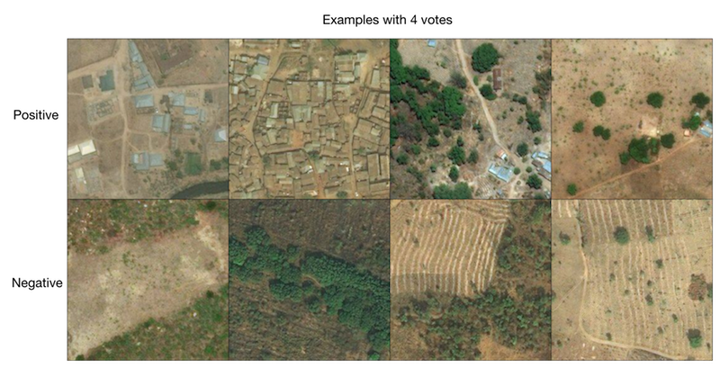
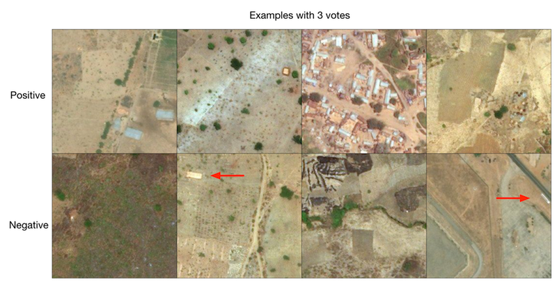
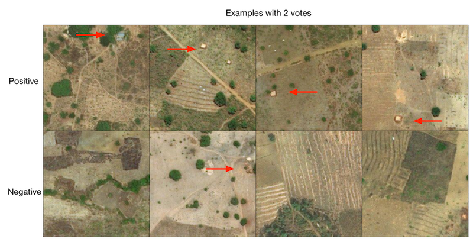
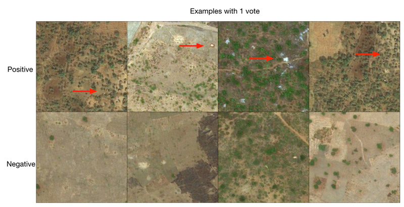

# Experiment 2

This experiment was based on the code used in Experiment 1 but with the model replaced by that from the VGG16 
network of [Simonyan and Zisserman](https://arxiv.org/abs/1409.1556) as implmented in the [Keras library](https://keras.io/).
See [this Keras file](https://github.com/keras-team/keras/blob/master/keras/applications/vgg16.py) for more details on their implementation.

[mapswipe_train_convnet_expt_2.py](mapswipe_train_convnet_expt_2.py)


# The Model 

```
_________________________________________________________________
Layer (type)                 Output Shape              Param #   
=================================================================
block1_conv1 (Conv2D)        (None, 224, 224, 64)      1792      
_________________________________________________________________
block1_conv2 (Conv2D)        (None, 224, 224, 64)      36928     
_________________________________________________________________
block1_pool (MaxPooling2D)   (None, 112, 112, 64)      0         
_________________________________________________________________
block2_conv1 (Conv2D)        (None, 112, 112, 128)     73856     
_________________________________________________________________
block2_conv2 (Conv2D)        (None, 112, 112, 128)     147584    
_________________________________________________________________
block2_pool (MaxPooling2D)   (None, 56, 56, 128)       0         
_________________________________________________________________
block3_conv1 (Conv2D)        (None, 56, 56, 256)       295168    
_________________________________________________________________
block3_conv2 (Conv2D)        (None, 56, 56, 256)       590080    
_________________________________________________________________
block3_conv3 (Conv2D)        (None, 56, 56, 256)       590080    
_________________________________________________________________
block3_pool (MaxPooling2D)   (None, 28, 28, 256)       0         
_________________________________________________________________
block4_conv1 (Conv2D)        (None, 28, 28, 512)       1180160   
_________________________________________________________________
block4_conv2 (Conv2D)        (None, 28, 28, 512)       2359808   
_________________________________________________________________
block4_conv3 (Conv2D)        (None, 28, 28, 512)       2359808   
_________________________________________________________________
block4_pool (MaxPooling2D)   (None, 14, 14, 512)       0         
_________________________________________________________________
block5_conv1 (Conv2D)        (None, 14, 14, 512)       2359808   
_________________________________________________________________
block5_conv2 (Conv2D)        (None, 14, 14, 512)       2359808   
_________________________________________________________________
block5_conv3 (Conv2D)        (None, 14, 14, 512)       2359808   
_________________________________________________________________
block5_pool (MaxPooling2D)   (None, 7, 7, 512)         0         
_________________________________________________________________
flatten (Flatten)            (None, 25088)             0         
_________________________________________________________________
fc1 (Dense)                  (None, 4096)              102764544 
_________________________________________________________________
fc2 (Dense)                  (None, 4096)              16781312  
_________________________________________________________________
predictions (Dense)          (None, 1)                 4097      
=================================================================
Total params: 134,264,641
Trainable params: 134,264,641
Non-trainable params: 0
_________________________________________________________________

```


## The Dataset

The dataset used was much larger than that used in Experiment 1. 
Image tiles from all MapSwipe projects at the end of January 2018, that had at least 5 votes marking them as Positive were 
downloaded and the same number of Negative tiles were selected as described previously. This yielded a total of 131,328
images in each class.

These were split into train, validation and test sets in the ratios of 0.7, 0.2, 0.1 respectively.


## Results

The model was trained for 50 epochs.

The model from the best epoch was saved and used to evaluate the Test dataset. This produced the results:
* loss 0.1184
* accuracy 0.9635



This plot shows relatively fast progress towards low loss and high accuracy, followed by a prolonged phase of slow, steady improvement.

Overfitting does not appear to be a significant issue. The learning rate was varied in several learning runs but all showed 
this phase of slow improvement. 



The histogram of predictions using the reserved Test dataset is very encouraging as it clearly separates the two states.
It would be interesting to look at the specific map tiles that gave rise to false assignments to see if these were
misclassified in the original dataset or if they represent an failure in the model.

## Applying the Model to Images with Higher Ambiguity

Each MapSwipe tile is tagged by multiple users of the phone app. It is reasonable to assume that a tile with 
multiple tags, or votes, by users is more likely to be a true positive compared to a tile with a single vote.

An individual tile with several obvious buildings is likely to receive multiple votes by users of the app.

Other tiles that do not contain any buildings might have some other feature, such as a rock or small pool, that one or two users
mistakenly interpret as a building. In some cases simple user error in clicking the phone screen may also create a false positive vote.

In practice there tend to be many more tiles with a single vote than those with, say, 5 votes. This adds a great deal of
'noise' to the final tile assignments that are passed to people working in the Missing Maps project with these areas.

There is the potential for a good trained network to serve as a secondary screen of these more abiguous tiles and thereby reduce this noise.

To study this I took the VGG16 trained network, which only used tiles that had at least 5 votes, and applied it to tiles
from project 4877 (MapSwipe Nigeria for MSF 3) that had 1 through 4 votes.



Tiles with 4 votes (red) showed nearly 90% with a high prediction score, indicating that these MapSwipe assignments agree with the model.

Those with 3 votes (orange) showed nearly 70% with a high score but also around 10% with a very low score indicating potential false positives.

Those with 2 votes (green) were equally distributed between high and low scores, indicating a higher false positive rate.

Those with only a single vote (blue) showed around 70% predicted to be negative.

Those findings agree with what I expected from the number of user assignments. To study this further I selected several images at 
random from the predicted positive and negative sets for each of these four groups and examined them manually.

Images from each of these are shown below. Because of size limitations it can be difficult to make out some of the features
and so I have added red arrows as appropriate.



Images with 4 votes would be expected to show obvious buildings and the positive panel agrees with this. The negative images
show no buildings and it is unclear why these received votes. One explanation might be that they shown signs of human
activity, such as tracks, but these do not meet the specific goal of the project which it is to identify buildings.



Some images with 3 votes are less obvious. The second from the left, for example, shows a single structure. But all of these
appear to be true positives.
Two of the predicted negatives show rectangular objects and two do not.



The predicted positive images with 2 votes contain only one or two apparent structures and so some users of the MapSwipe app might be 
less confident about assigning them as positive.

Of the four images that are predicted to be negative, one contains a small cluster of circular structures which should count as a positive.
The other three appear to be true negatives.




Images with only a single vote are, by definition, somewhat ambiguous. of the four predicted positives, two contain clusters
of circular buildings, one contains a single rectangular structure and the last contains a small irregular object next to a track, which may 
not be a true positive.

None of the predicted negatives in this set appears to contain a real building.


The histogram and the manual analysis both suggest that this trained network could be an effective secondary screen of 
completed MapSwipe datasets, serving to remove, or flag, likely false positives. This could help downstream users in 
Missing Maps process the results more effectively.

## Next Steps

A great deal of focus in using Machine Learning for image classification uses pre-existing trained networks for Transfer Learning. This
has proved very effective in various object recognition projects, such as facial recognition, self-driving cars.

My initial experiments with this have not produced results anywhere near as good as those shown here, using a network that was trained
solely on map tiles. The images in these tiles are quite distinct from the large general images datasets used in other 
projects which include people, faces, cars, etc. 

I hope to study those approaches in more detail to see if this is indeed correct.

Because even the MapSwipe images with multiple votes can contain apparent negatives there may be the opportunity to use the
trained network to remove these prior to a second round of training. There is, of course, a risk here in introducing a bias 
into the training datasets.
 
